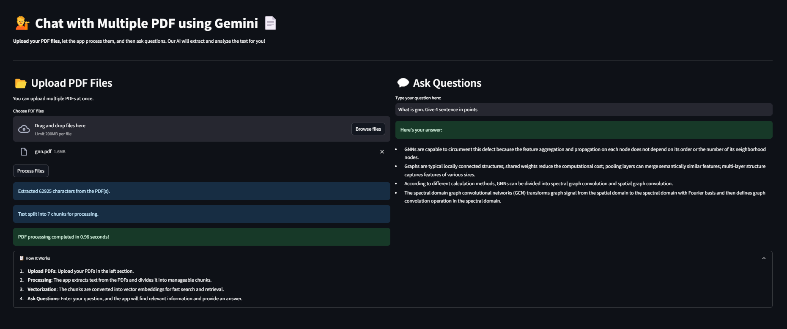

# PDF Conversational App using AI 🤖📄



### [Live Demo](https://multiplechat.streamlit.app/)

This is a Streamlit-based web application that allows users to upload PDF files and interact with the content through a conversational interface. Powered by Google Generative AI (Gemini) and FAISS, the app enables users to ask questions from the uploaded PDF files and receive relevant answers.

## Features
- 📄 **Upload Multiple PDFs**: Upload one or more PDF files for processing.
- 🔍 **Text Extraction and Chunking**: The app extracts text from the PDFs and splits it into manageable chunks for efficient processing.
- 🧠 **Google Generative AI**: Answers user questions using AI by finding relevant information from the PDF files.
- 📦 **FAISS for Efficient Search**: Uses FAISS to create in-memory embeddings for fast similarity-based search.
- 💬 **Conversational Interface**: Ask questions and receive detailed answers based on the content of the uploaded PDF files.

## How It Works
1. **Upload PDFs**: Upload your PDF documents using the file uploader on the left sidebar.
2. **Process PDFs**: Once uploaded, the app extracts and processes text from the PDFs and stores it in-memory using FAISS.
3. **Ask Questions**: Use the question box to ask questions related to the uploaded PDFs. The app will respond with answers based on the document content.

## Getting Started

### Prerequisites
- Python 3.x
- A valid API key for [Google Generative AI](https://cloud.google.com/ai-generative)
- FAISS and LangChain for vector search and AI-driven conversations

### Installation

1. Clone the repository:

    ```bash
    git clone https://github.com/KrishnaRauniyar/Langchain_MultiPDF_Chat.git
    cd pdf-conversational-app
    ```

2. Install the required dependencies:

    ```bash
    pip install -r requirements.txt
    ```

3. Set up environment variables:
    - Create a `.env` file and add your Google Generative AI API key:

    ```bash
    GOOGLE_API_KEY=your_google_api_key
    ```

4. Run the Streamlit app locally:

    ```bash
    streamlit run multipdf.py
    ```

## Deployment
The app is live and can be accessed via Streamlit Cloud:
[https://multiplechat.streamlit.app/](https://multiplechat.streamlit.app/)

## Example Questions
- "What is the main topic discussed on page 5?"
- "Can you summarize the PDF?"
- "Give me details on section 3 of the document."

## Technologies Used
- **Streamlit**: For creating the interactive UI.
- **Google Generative AI**: To generate conversational answers.
- **FAISS**: For fast similarity search of document chunks.
- **LangChain**: To integrate AI models with the app.

## Screenshot


